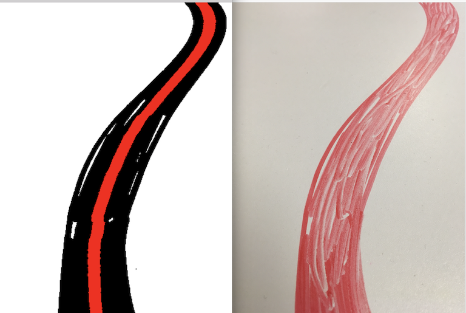

# drive
we are starting follow the line competition, since we dont have robots
yet, we can start writing the code that gets the path from the camera

# first steps

* draw a line on the table, about 3cm wide with red erasable marker
* take a picture from your iphone at 45° angle
* save it in data/
* run node index.js ../data/picture.png

