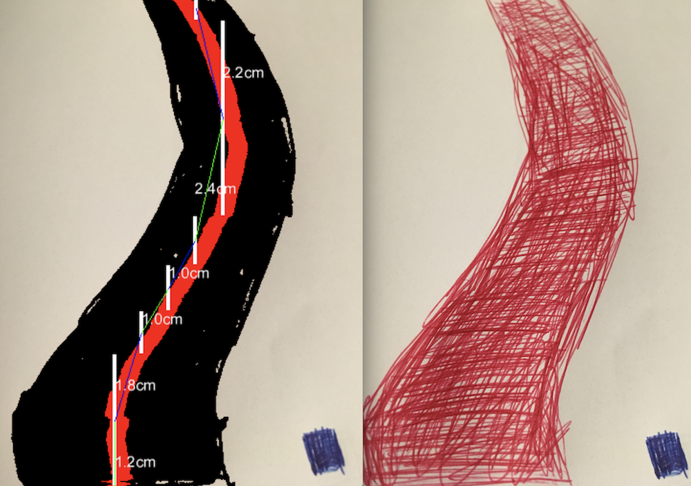

# drive
we are starting follow the line competition in [HackYourFuture](http://www.hackyourfuture.net/), since we dont have robots
yet, we can start writing the code that gets the path from the camera

# first steps

* draw a line on the table, about 4cm wide with red erasable marker (change the width in index.js, it is using this width to compute pixel to meter ratio)
* take a picture from your iphone at 45° angle
* save it in data/
* run node index.js ../data/picture.png

